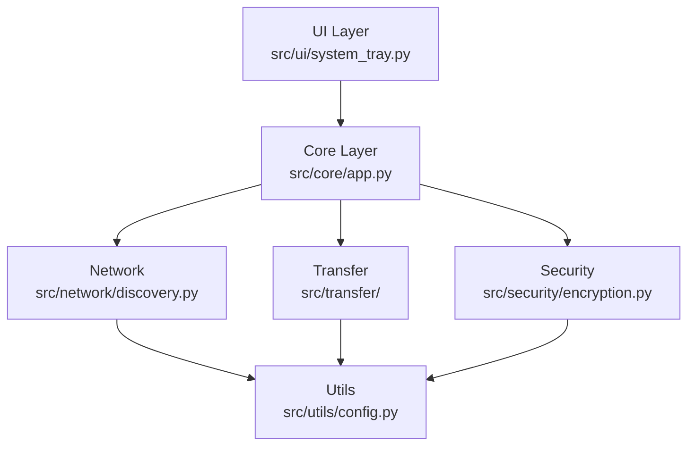
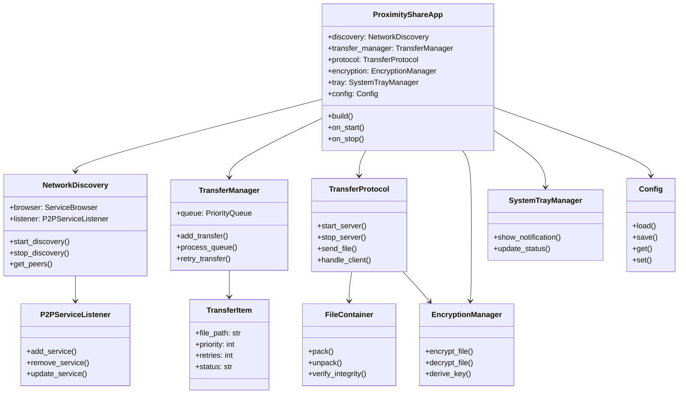
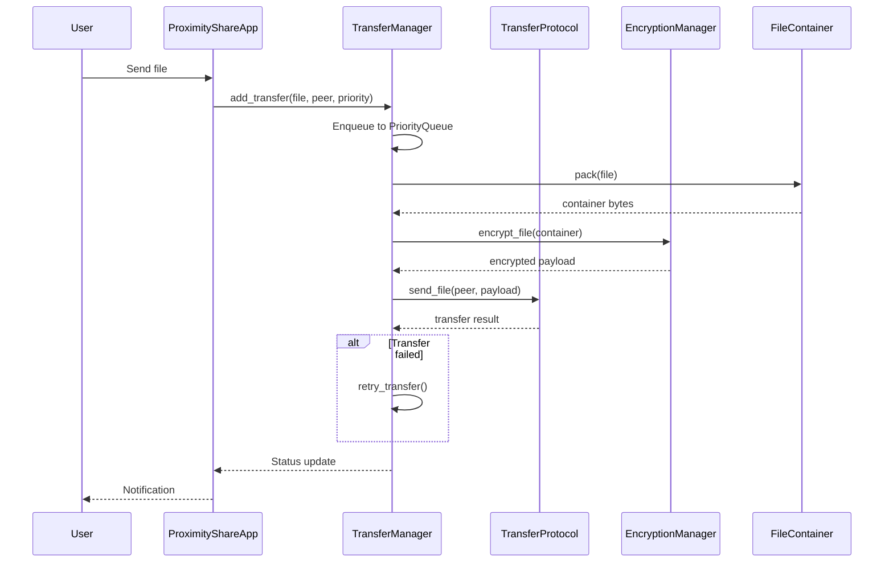
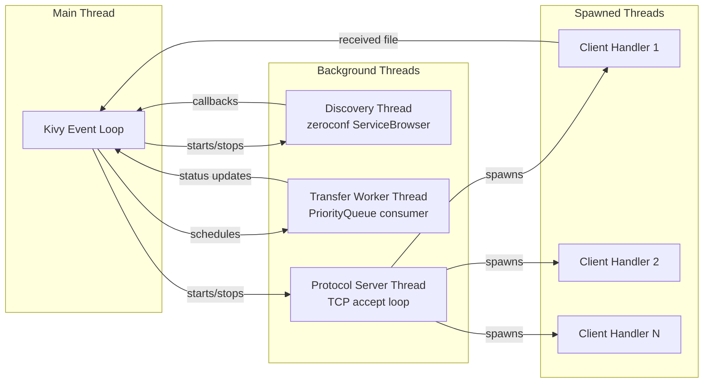

# Proximity Share - System Architecture

## High-Level Architecture

- Kivy application with modular package structure
- Event-driven with background threads for network and transfer
- Layered: UI → Core → Network/Transfer/Security → Utils

## Package Structure

| Module | Class(es) | Responsibility |
|--------|-----------|----------------|
| `src/core/app.py` | `ProximityShareApp` | Main Kivy App, orchestrates all services |
| `src/network/discovery.py` | `NetworkDiscovery`, `P2PServiceListener` | mDNS device discovery via zeroconf |
| `src/transfer/protocol.py` | `TransferProtocol` | TCP server/client, binary message framing |
| `src/transfer/manager.py` | `TransferManager`, `TransferItem` | PriorityQueue-based transfer scheduling, retry logic |
| `src/transfer/container.py` | `FileContainer` | Serialization format with integrity checks |
| `src/security/encryption.py` | `EncryptionManager` | Fernet symmetric encryption, PBKDF2 key derivation |
| `src/ui/system_tray.py` | `SystemTrayManager` | Kivy widget + plyer notifications |
| `src/utils/config.py` | `Config` | JSON config management with defaults |

## Design Patterns

| Pattern | Application |
|---------|-------------|
| **Observer** | `P2PServiceListener` reacts to mDNS service add/remove/update events |
| **Producer-Consumer** | `TransferManager` queue with dedicated worker thread consuming items |
| **Facade** | `ProximityShareApp` provides unified interface to all subsystems |
| **Strategy** | Priority assignment based on file size for transfer scheduling |

## Threading Model

- **Main thread**: Kivy event loop (UI rendering, user interaction)
- **Discovery thread**: Managed by zeroconf `ServiceBrowser`
- **Transfer worker thread**: Processes `PriorityQueue` items sequentially
- **Protocol server thread**: Accepts incoming TCP connections
- **Per-client handler threads**: Spawned per inbound connection

