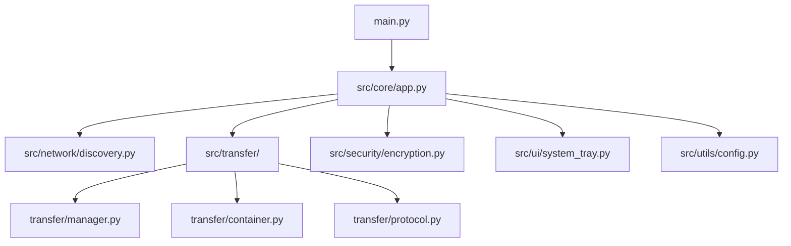
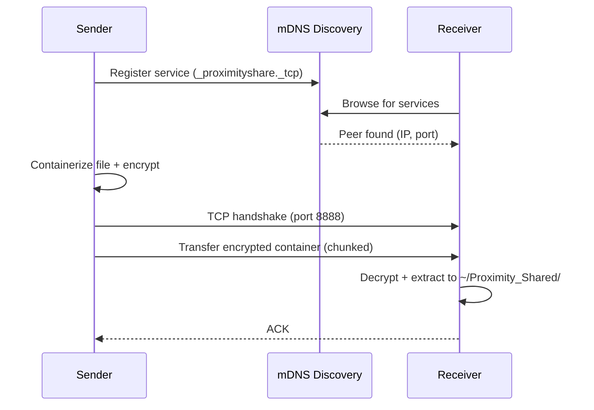

# Proximity Share — Codebase Information

## Overview

**Proximity Share** is a Python desktop application for peer-to-peer file sharing between personal devices on a local network. It uses mDNS for device discovery and a custom transfer protocol with end-to-end encryption.

## Tech Stack

| Layer | Technology |
|-------|-----------|
| Language | Python 3 |
| UI Framework | Kivy / KivyMD |
| Discovery | zeroconf (mDNS/DNS-SD) |
| Encryption | cryptography (Fernet symmetric) |
| File Monitoring | watchdog |
| Notifications | plyer |
| Config Format | INI (static), JSON (runtime) |

## Entry Point

```
main.py → ProximityShareApp
```

`main.py` initializes the Kivy application, loads configuration, starts the mDNS discovery service, and launches the system tray integration.

## Package Structure



## Module Responsibilities

### src/core/app.py
Main application class. Orchestrates all subsystems — initializes config, starts discovery, manages transfer lifecycle.

### src/network/discovery.py
Uses zeroconf to register the device on the local network and discover peers via mDNS service browsing.

### src/transfer/manager.py
Priority-based transfer queue with retry logic. Manages concurrent uploads/downloads.

### src/transfer/container.py
Packages files into a cross-platform container format with metadata (filename, size, checksums).

### src/transfer/protocol.py
Custom TCP-based transfer protocol. Handles handshake, chunked transfer, and acknowledgement.

### src/security/encryption.py
Fernet-based symmetric encryption for file payloads. Handles key exchange and encrypted container wrapping.

### src/ui/system_tray.py
System tray icon with context menu. Provides notifications via plyer for transfer events.

### src/utils/config.py
Loads and manages configuration from both static and runtime sources.

## Data Flow



## Configuration

### Static Config — `config/app.ini`

Application defaults bundled with the source. Read at startup.

### Runtime Config — `~/.proximity_share/config.json`

User-specific settings created on first run. Overrides static defaults.

Key settings:
- Device name and ID
- Shared folder path (default: `~/Proximity_Shared/`)
- Network port (default: `8888`)
- Discovery preferences
- Security/encryption settings

## Networking

- **Protocol**: Custom TCP-based on port **8888**
- **Discovery**: mDNS service type `_proximityshare._tcp.local.`
- **Scope**: Local network (LAN) only

## Shared Folder

Received files land in `~/Proximity_Shared/` by default. Configurable via runtime config.
