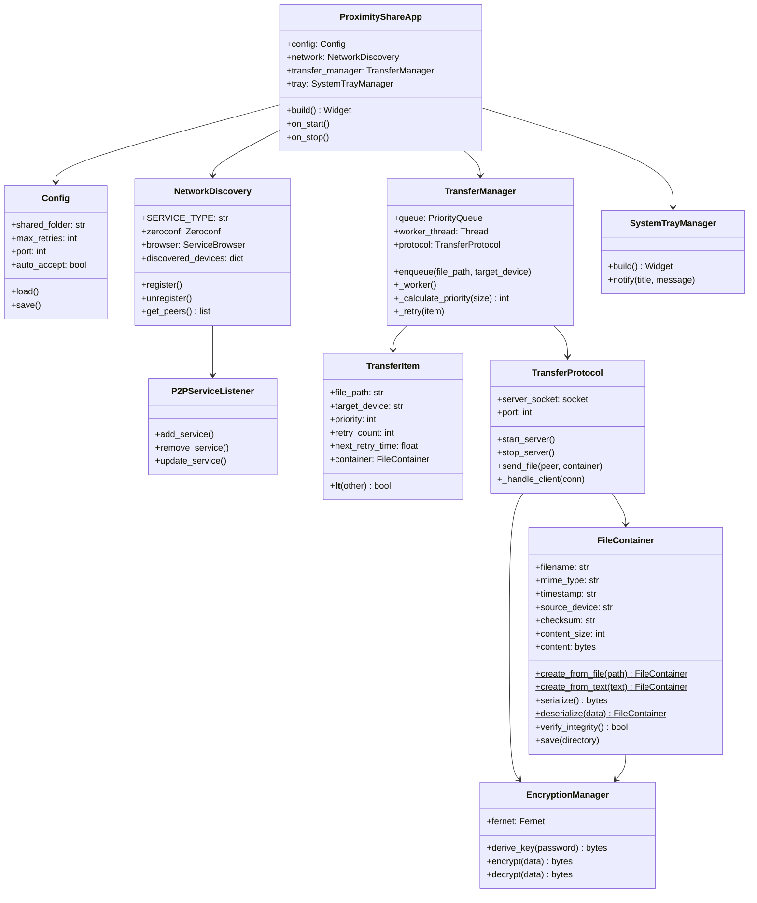
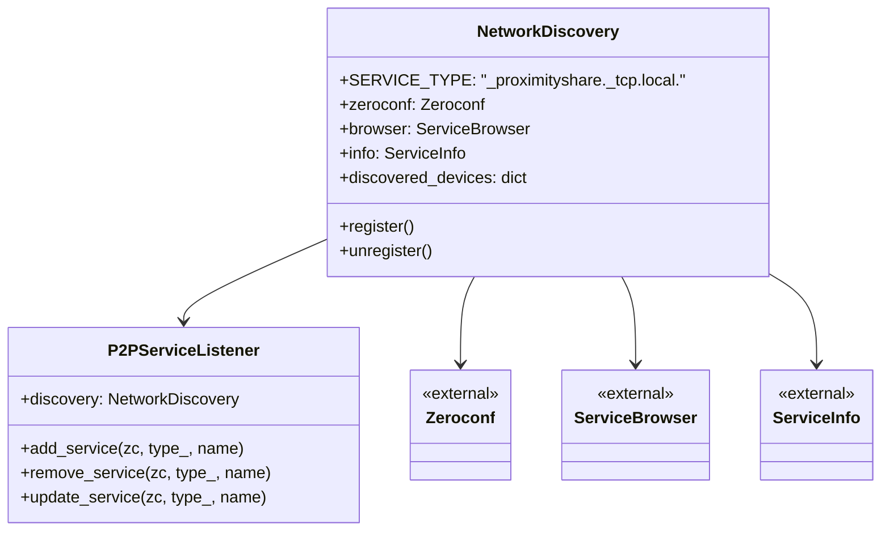
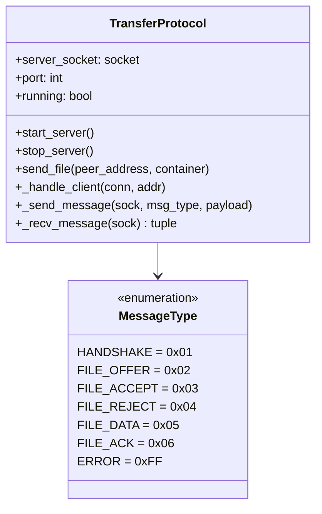
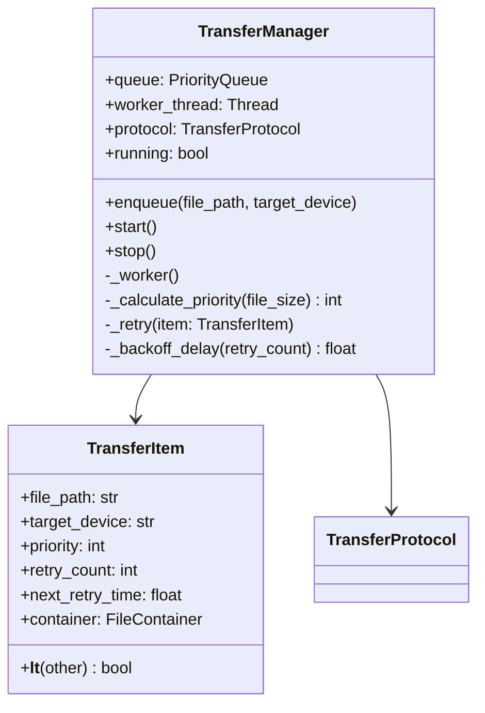
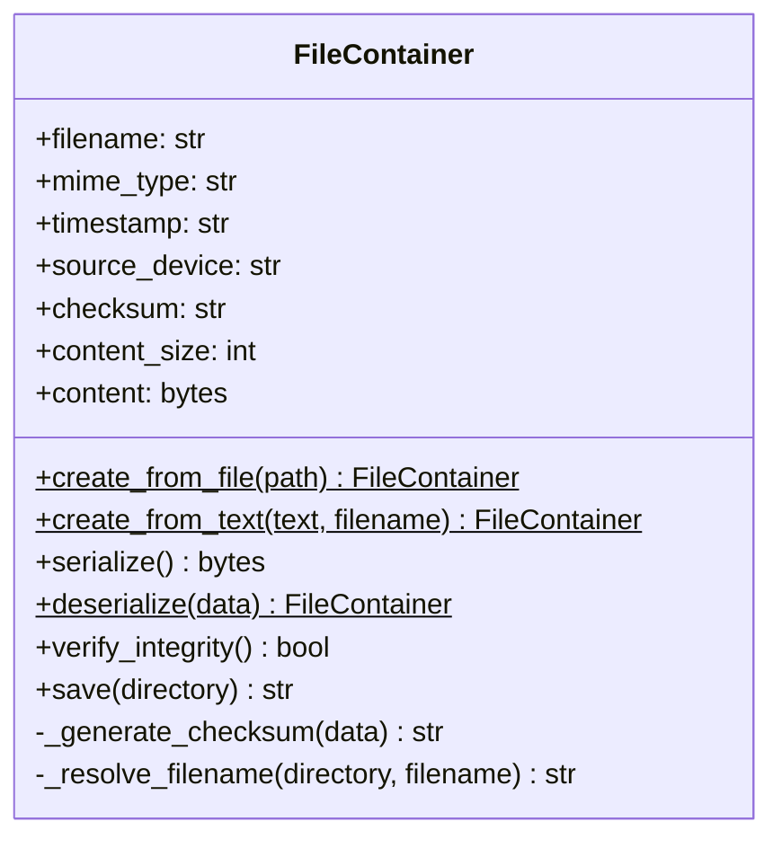
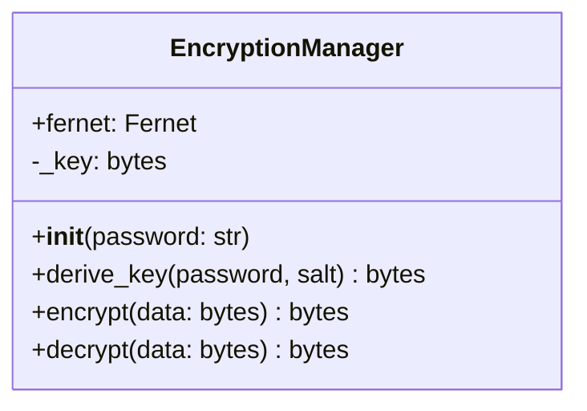
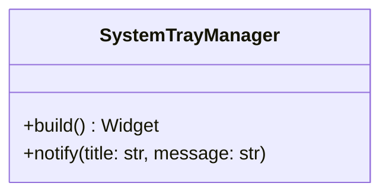
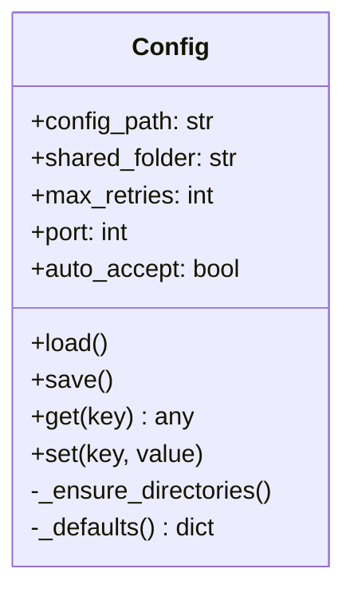

# Proximity Share - Component Documentation

## Architecture Overview



## Components

### 1. ProximityShareApp (`src/core/app.py`)

Kivy `App` subclass that orchestrates the full application lifecycle.

- **Initializes**: Config, NetworkDiscovery, TransferManager, SystemTrayManager
- **Deferred start**: Uses `Clock.schedule_once` to start network services after the UI event loop is running
- **Lifecycle**: `on_start()` triggers discovery and transfer server; `on_stop()` tears down all services

---

### 2. NetworkDiscovery (`src/network/discovery.py`)

Handles mDNS-based automatic device discovery on the local network.

- **SERVICE_TYPE**: `_proximityshare._tcp.local.`
- **Dependencies**: `zeroconf.Zeroconf`, `ServiceBrowser`, `ServiceInfo`
- **Behavior**: Registers this device as a service, browses for peers, maintains a `discovered_devices` dict keyed by device name



---

### 3. P2PServiceListener (`src/network/discovery.py`)

Implements `zeroconf.ServiceListener` interface.

- **add_service**: Resolves service info, adds peer to `discovered_devices`
- **remove_service**: Removes peer from `discovered_devices`

---

### 4. TransferProtocol (`src/transfer/protocol.py`)

TCP-based binary protocol for file transfer between peers.

- **Server**: Threaded TCP socket server accepting incoming transfers
- **Binary header**: 8 bytes total — 4B message type + 4B message size (network-order `uint32`)



**Transfer flow** (`send_file()`):
1. Connect to peer
2. Send `FILE_OFFER` with file metadata
3. Wait for `FILE_ACCEPT` or `FILE_REJECT`
4. On accept: send `FILE_DATA` with serialized container bytes
5. Wait for `FILE_ACK`

---

### 5. TransferManager (`src/transfer/manager.py`)

Priority-based transfer queue with automatic retry logic.

- **Queue**: `PriorityQueue` with background worker thread
- **Priority assignment**:
  - Priority 1: files < 100KB
  - Priority 2: files < 10MB
  - Priority 3: files ≥ 10MB
- **Retry policy**: Exponential backoff, base delay 30s, max delay 1800s, max 10 attempts



---

### 6. TransferItem (`src/transfer/manager.py`)

Dataclass-like object representing a single queued transfer.

| Field | Type | Description |
|-------|------|-------------|
| `file_path` | `str` | Path to source file |
| `target_device` | `str` | Destination peer identifier |
| `priority` | `int` | Queue priority (1=highest) |
| `retry_count` | `int` | Number of retries attempted |
| `next_retry_time` | `float` | Timestamp for next retry |
| `container` | `FileContainer` | Serialized file container |

Implements `__lt__` for `PriorityQueue` ordering by priority value.

---

### 7. FileContainer (`src/transfer/container.py`)

Cross-platform binary file format for transfer.

**Serialization format**:
```
[4B metadata_size (big-endian)] [JSON metadata] [raw file content]
```

**Metadata fields**:
- `filename` — original file name
- `mime_type` — detected MIME type
- `timestamp` — ISO creation timestamp
- `source_device` — sender device name
- `checksum` — SHA-256 hex digest
- `content_size` — byte count of raw content



- **Integrity**: SHA-256 checksum verified on deserialization
- **Duplicate handling**: Counter-based rename (e.g., `file(1).txt`, `file(2).txt`)

---

### 8. EncryptionManager (`src/security/encryption.py`)

Symmetric encryption layer for file transfer security.

- **Algorithm**: Fernet (AES-128-CBC with HMAC-SHA256)
- **Key derivation**: PBKDF2HMAC with SHA256, 100,000 iterations, static salt
- **Note**: Uses a default password placeholder (to be replaced with device pairing exchange)



---

### 9. SystemTrayManager (`src/ui/system_tray.py`)

Desktop integration providing system tray presence and notifications.

- **UI**: Returns a root Kivy `Label` widget (placeholder for future full UI)
- **Notifications**: Uses `plyer.notification` for cross-platform desktop notifications



---

### 10. Config (`src/utils/config.py`)

Application configuration management with JSON persistence.

- **Path**: `~/.proximity_share/config.json`
- **Auto-creates** config directory and shared folder on first run

| Setting | Default | Description |
|---------|---------|-------------|
| `shared_folder` | `~/Proximity_Shared/` | Received files destination |
| `max_retries` | `10` | Maximum transfer retry attempts |
| `port` | `8888` | TCP listening port |
| `auto_accept` | `true` | Auto-accept incoming transfers |


