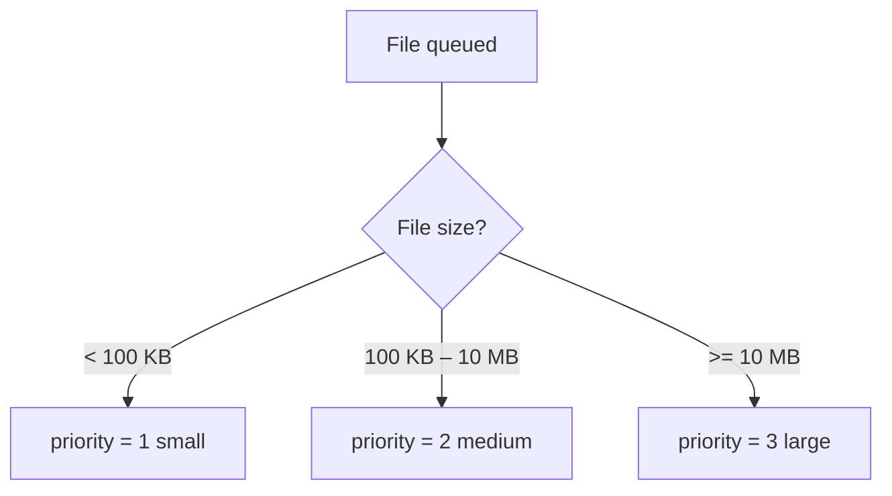
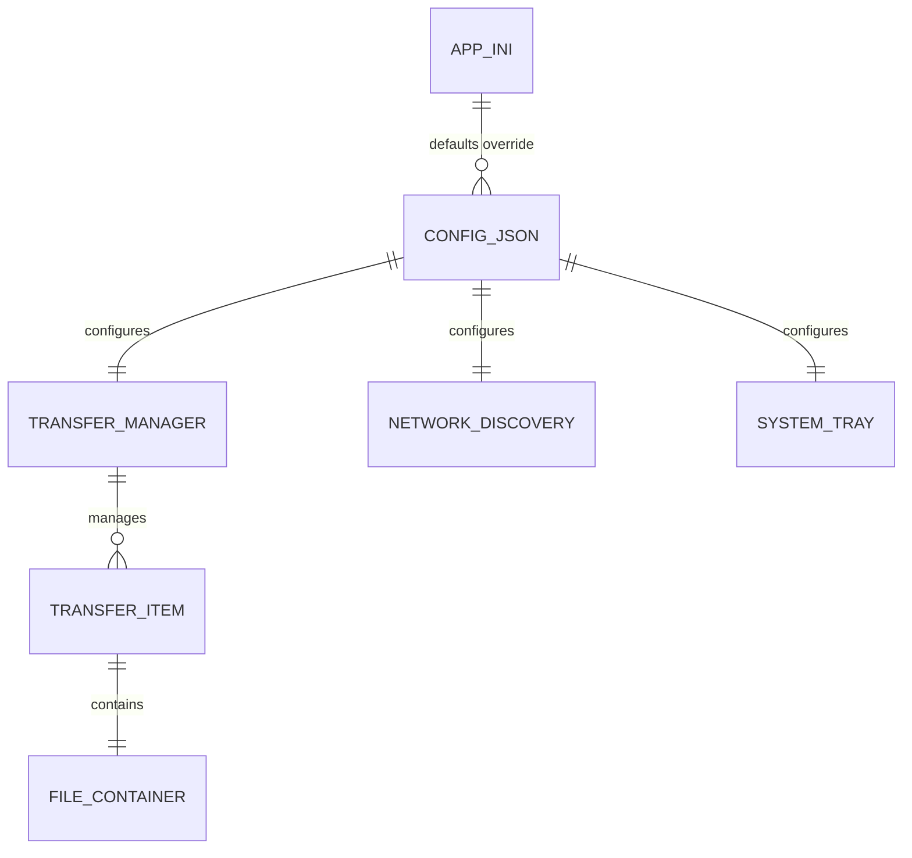

# Data Models

## FileContainer Format

### Wire Format

```
[4B metadata_size BE][JSON metadata][raw content bytes]
```


### Metadata Fields

| Field | Type | Description |
|-------|------|-------------|
| `filename` | `str` | Original filename with extension |
| `mime_type` | `str` | MIME type (e.g. `application/pdf`) |
| `timestamp` | `str` | ISO 8601 creation time |
| `source_device` | `str` | Sending device's name |
| `checksum` | `str` | SHA-256 hex digest of raw content |
| `content_size` | `int` | Size of raw content in bytes |

---

## TransferItem

Represents a single queued transfer operation.

| Field | Type | Default | Description |
|-------|------|---------|-------------|
| `file_path` | `Path` | — | Local path to the source file |
| `target_device` | `str` | — | Target device IP address |
| `priority` | `int` | — | `1`=small, `2`=medium, `3`=large |
| `retry_count` | `int` | `0` | Current retry attempt |
| `max_retries` | `int` | `10` | Maximum allowed retries |
| `next_retry_time` | `float` | `0.0` | Unix timestamp for next retry |
| `container` | `FileContainer \| None` | `None` | Prepared container (lazy-built) |

### Priority Assignment



---

## Config Schema (JSON)

Stored at `~/.proximity_share/config.json`.

```json
{
  "shared_folder": "~/Proximity_Shared",
  "max_retries": 10,
  "port": 8888,
  "device_name": "my-laptop",
  "auto_accept_files": true,
  "notification_enabled": true
}
```

| Field | Type | Description |
|-------|------|-------------|
| `shared_folder` | `str` | Directory path for received files |
| `max_retries` | `int` | Maximum transfer retry attempts |
| `port` | `int` | TCP port for the transfer protocol |
| `device_name` | `str` | Human-readable device identifier |
| `auto_accept_files` | `bool` | Skip accept/reject prompt |
| `notification_enabled` | `bool` | Show desktop notifications |

---

## app.ini Schema

Static application defaults at `config/app.ini`.

### Sections

#### `[app]`

| Key | Type | Description |
|-----|------|-------------|
| `title` | `str` | Application window title |
| `version` | `str` | Application version string |

#### `[network]`

| Key | Type | Description |
|-----|------|-------------|
| `default_port` | `int` | Default TCP port |
| `discovery_interval` | `int` | mDNS browse interval (seconds) |
| `connection_timeout` | `int` | TCP connect timeout (seconds) |

#### `[transfer]`

| Key | Type | Description |
|-----|------|-------------|
| `max_retries` | `int` | Default max retry count |
| `retry_base_delay` | `float` | Base delay for exponential backoff (seconds) |
| `max_retry_delay` | `float` | Cap on retry delay (seconds) |
| `buffer_size` | `int` | Read/write buffer size (bytes) |

#### `[ui]`

| Key | Type | Description |
|-----|------|-------------|
| `show_notifications` | `bool` | Enable notifications by default |
| `minimize_to_tray` | `bool` | Minimize to system tray on close |

### Relationships


