# Proximity Share — Dependencies

## Runtime Dependencies (requirements.txt)

| Package | Purpose |
|---------|---------|
| kivy>=2.1.0 | UI framework, event loop, application lifecycle |
| kivymd>=1.1.1 | Material Design widgets for Kivy |
| zeroconf>=0.47.1 | mDNS service discovery and advertisement |
| cryptography>=3.4.8 | Fernet encryption, PBKDF2 key derivation |
| watchdog>=2.1.9 | Filesystem monitoring (imported but not yet used in code) |
| plyer>=2.1.0 | Cross-platform notifications |

## Standard Library Usage

| Module | Purpose |
|--------|---------|
| socket | TCP server/client |
| threading | Background workers |
| struct | Binary protocol framing |
| json | Config and container metadata serialization |
| hashlib | SHA-256 checksums |
| mimetypes | File type detection |
| pathlib | Path handling |
| queue.PriorityQueue | Transfer ordering |
| time | Retry timing |
| os | Environment variables, path operations |
| base64 | Key encoding |

## Dependency Relationships

```mermaid
graph TD
    subgraph Components
        APP[core/app.py]
        DISC[network/discovery.py]
        MGR[transfer/manager.py]
        CONT[transfer/container.py]
        PROTO[transfer/protocol.py]
        TRAY[ui/system_tray.py]
        ENC[security/encryption.py]
        CFG[utils/config.py]
    end

    subgraph "External Packages"
        KIVY[kivy]
        KIVYMD[kivymd]
        ZERO[zeroconf]
        CRYPTO[cryptography]
        WATCHDOG[watchdog]
        PLYER[plyer]
    end

    subgraph "Standard Library"
        SOCKET[socket]
        THREADING[threading]
        STRUCT[struct]
        JSON[json]
        HASHLIB[hashlib]
        MIMETYPES[mimetypes]
        PATHLIB[pathlib]
        PQUEUE[queue.PriorityQueue]
        TIME[time]
        OS[os]
        BASE64[base64]
    end

    APP --> KIVY
    APP --> KIVYMD
    APP --> THREADING

    DISC --> ZERO
    DISC --> SOCKET
    DISC --> THREADING

    MGR --> PQUEUE
    MGR --> THREADING
    MGR --> TIME

    CONT --> JSON
    CONT --> HASHLIB
    CONT --> MIMETYPES
    CONT --> PATHLIB
    CONT --> OS

    PROTO --> SOCKET
    PROTO --> STRUCT
    PROTO --> THREADING

    TRAY --> PLYER
    TRAY --> KIVY

    ENC --> CRYPTO
    ENC --> BASE64
    ENC --> HASHLIB

    CFG --> JSON
    CFG --> PATHLIB
    CFG --> OS
```

