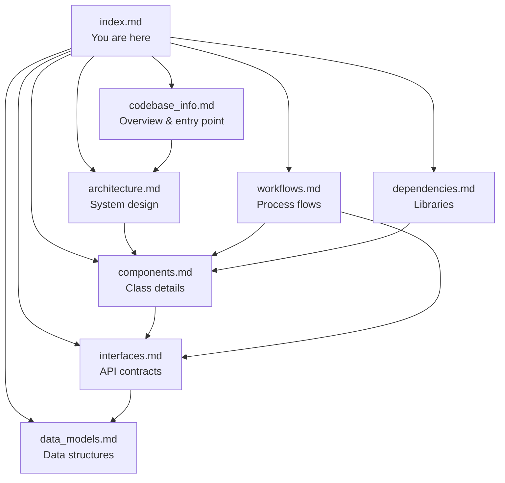

# Proximity Share — Documentation Index

## Instructions for AI Assistants

This file is the **primary entry point** for understanding the Proximity Share project. When loaded into context, use it to navigate to the appropriate documentation file for the user's question.

### How to Use This Index

1. **Read this file first** — it provides the map of all documentation.
2. **Consult specific files** based on the user's question category (see routing table below).
3. **Cross-reference** related files when questions span multiple domains.

---

## Table of Contents

| File | Purpose | Consult When... |
|------|---------|-----------------|
| [codebase_info.md](./codebase_info.md) | Tech stack, entry point, module map, data flow, configuration | User asks about project structure, how it boots, or needs onboarding context |
| [architecture.md](./architecture.md) | Layered design, package structure, design patterns, threading model | User asks about system design, concurrency, or how components relate |
| [components.md](./components.md) | All 10 classes with responsibilities, methods, and relationships | User asks about a specific class, what it does, or how to modify it |
| [interfaces.md](./interfaces.md) | Method signatures, TCP binary protocol, mDNS service interface | User asks about API contracts, message formats, or integration points |
| [data_models.md](./data_models.md) | FileContainer wire format, TransferItem, Config schema, app.ini | User asks about data structures, serialization, or configuration keys |
| [workflows.md](./workflows.md) | Startup, send, receive, discovery, and retry sequences | User asks "how does X work end-to-end?" or needs to trace a flow |
| [dependencies.md](./dependencies.md) | External packages, stdlib usage, dependency graph | User asks what libraries are used, why, or which component uses what |

---

## File Relationships

---

## Question Routing Guide

| Question Category | Primary File | Secondary File |
|-------------------|--------------|----------------|
| "What framework/language is this?" | codebase_info.md | dependencies.md |
| "How does file transfer work?" | workflows.md | interfaces.md |
| "Where is configuration stored?" | data_models.md | codebase_info.md |
| "How do devices discover each other?" | workflows.md | components.md |
| "How is encryption handled?" | components.md | interfaces.md |
| "What's the entry point?" | codebase_info.md | workflows.md |
| "What are the message types?" | interfaces.md | data_models.md |
| "How does retry logic work?" | workflows.md | components.md |
| "What does class X do?" | components.md | interfaces.md |
| "How do I add a new feature?" | architecture.md | components.md |
| "What libraries does this use?" | dependencies.md | codebase_info.md |

---

## Conventions

- **Diagrams**: All visual representations use Mermaid syntax (no ASCII art).
- **No volatile metrics**: Documentation does not include line counts or file sizes.
- **Paths**: All paths are relative to the project root unless explicitly marked as absolute.
