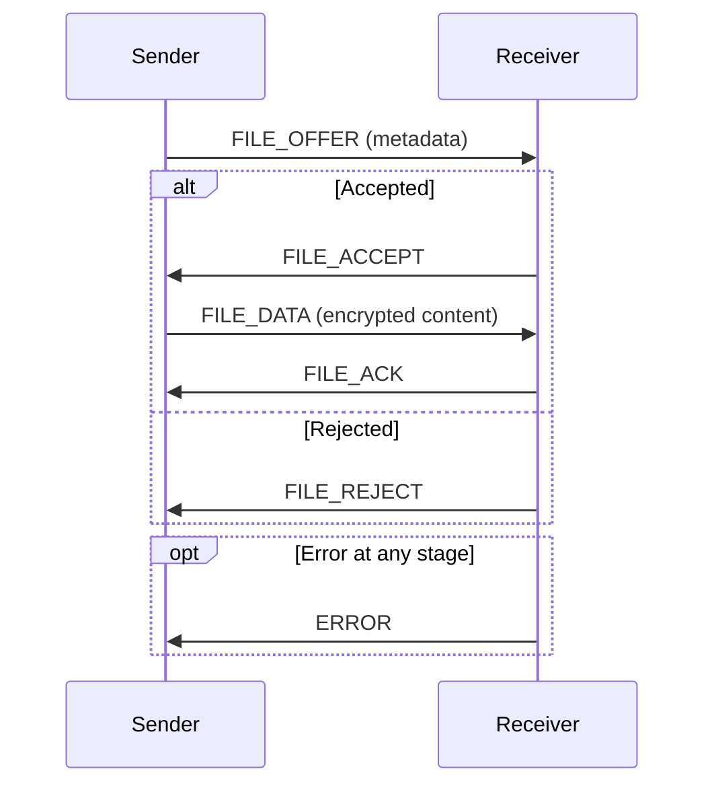

# Interfaces and APIs

## Internal APIs

### NetworkDiscovery

| Method | Signature | Description |
|--------|-----------|-------------|
| `start()` | `() → None` | Begin mDNS browsing and register this device |
| `stop()` | `() → None` | Unregister service and stop browsing |
| `get_discovered_devices()` | `() → dict[str, ServiceInfo]` | Return currently visible devices |
| `on_device_discovered(info)` | `(ServiceInfo) → None` | Callback when a new device appears |
| `on_device_removed(name)` | `(str) → None` | Callback when a device disappears |

### TransferManager

| Method | Signature | Description |
|--------|-----------|-------------|
| `start()` | `() → None` | Start the transfer processing loop |
| `stop()` | `() → None` | Stop processing and drain queue |
| `queue_file(file_path, target_device)` | `(Path, str) → bool` | Enqueue a file for transfer; returns success |

### TransferProtocol

| Method | Signature | Description |
|--------|-----------|-------------|
| `start_server(port=8888)` | `(int) → None` | Listen for incoming transfers |
| `stop_server()` | `() → None` | Stop the listener |
| `send_file(container, target_device)` | `(FileContainer, str) → bool` | Send a containerized file to target |

### FileContainer

| Method | Signature | Description |
|--------|-----------|-------------|
| `to_bytes()` | `() → bytes` | Serialize container to wire format |
| `from_bytes(data)` | `(bytes) → FileContainer` | Deserialize from wire format (classmethod) |
| `create_from_file(path)` | `(Path) → FileContainer` | Build container from a filesystem path (classmethod) |
| `create_from_text(text, filename)` | `(str, str) → FileContainer` | Build container from text content (classmethod) |
| `save_to_file(output_dir)` | `(Path) → Path` | Extract content to disk; returns saved path |
| `verify_integrity()` | `() → bool` | Validate checksum matches content |

### EncryptionManager

| Method | Signature | Description |
|--------|-----------|-------------|
| `encrypt_data(data)` | `(bytes) → bytes` | Encrypt arbitrary bytes |
| `decrypt_data(data)` | `(bytes) → bytes` | Decrypt arbitrary bytes |
| `encrypt_file_content(content)` | `(bytes) → bytes` | Encrypt file payload before transfer |
| `decrypt_file_content(content)` | `(bytes) → bytes` | Decrypt file payload after receipt |

### Config

| Method | Signature | Description |
|--------|-----------|-------------|
| `get_shared_folder()` | `() → Path` | Destination for received files |
| `get_device_name()` | `() → str` | This device's display name |
| `get_port()` | `() → int` | TCP port for transfers |
| `get_max_retries()` | `() → int` | Maximum retry attempts |
| `is_auto_accept_enabled()` | `() → bool` | Whether to auto-accept incoming files |
| `is_notification_enabled()` | `() → bool` | Whether desktop notifications are active |
| `save_config()` | `() → None` | Persist current settings to disk |

### SystemTrayManager

| Method | Signature | Description |
|--------|-----------|-------------|
| `get_root_widget()` | `() → QSystemTrayIcon` | Return the tray icon widget |
| `show_notification(title, msg)` | `(str, str) → None` | Display a generic notification |
| `notify_file_received(filename)` | `(str) → None` | Notify user of an incoming file |
| `notify_file_sent(filename, device)` | `(str, str) → None` | Notify user of a successful send |

---

## Network Protocol Interface

- **Transport**: TCP port `8888`
- **Binary framing**: `[4B msg_type uint32 BE][4B msg_size uint32 BE][payload]`

### Message Types

| Code | Name | Direction | Payload |
|------|------|-----------|---------|
| `0x01` | HANDSHAKE | Either | Protocol version info |
| `0x02` | FILE_OFFER | Sender → Receiver | FileContainer metadata JSON |
| `0x03` | FILE_ACCEPT | Receiver → Sender | Empty |
| `0x04` | FILE_REJECT | Receiver → Sender | Optional reason string |
| `0x05` | FILE_DATA | Sender → Receiver | Serialized FileContainer bytes |
| `0x06` | FILE_ACK | Receiver → Sender | Empty |
| `0xFF` | ERROR | Either | Error description string |

### Message Flow

---

## mDNS Service Interface

- **Service type**: `_proximityshare._tcp.local.`
- **Port**: `8888`
- **TXT record properties**:
  - `version=1.0`
  - `device=<hostname>`

