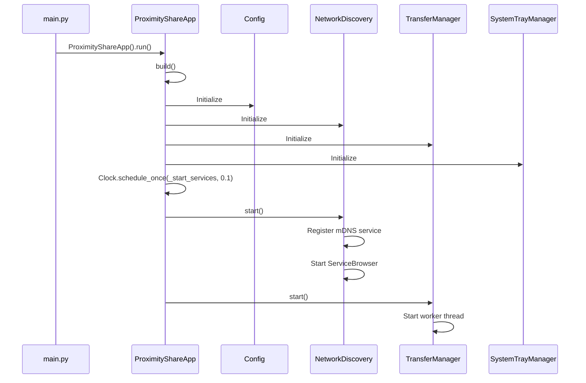
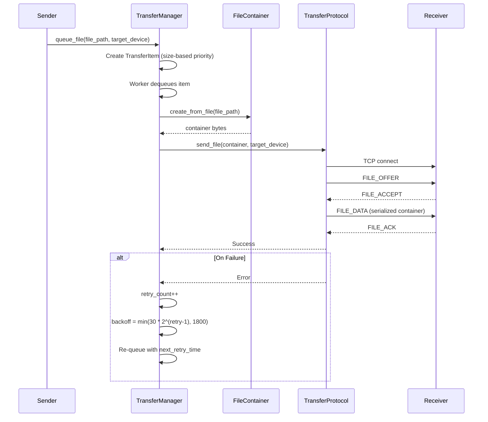
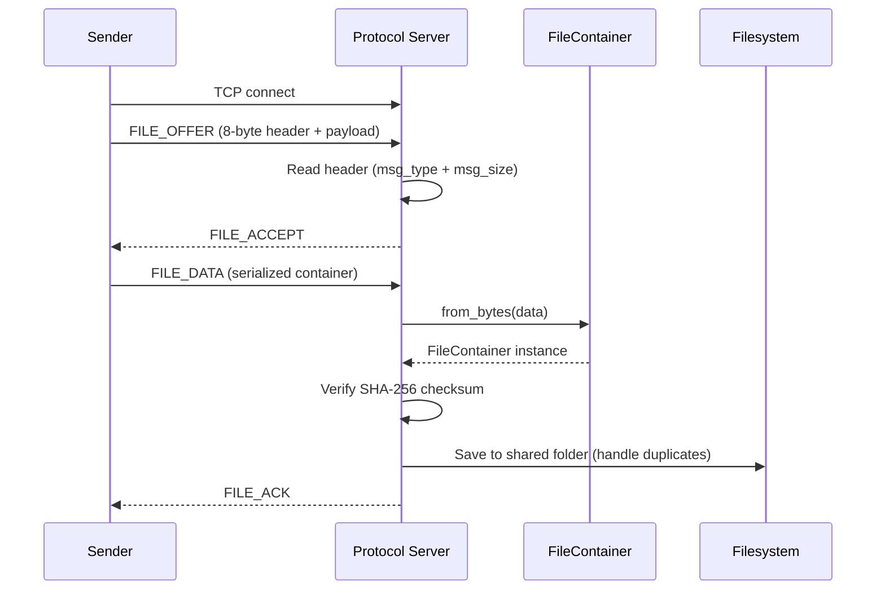
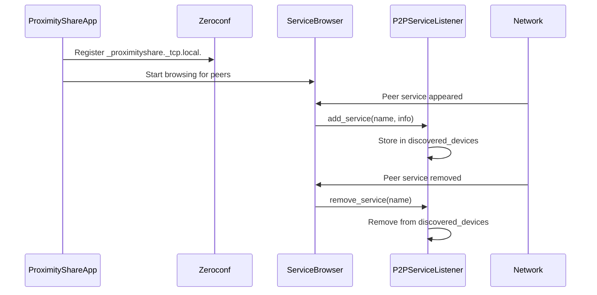
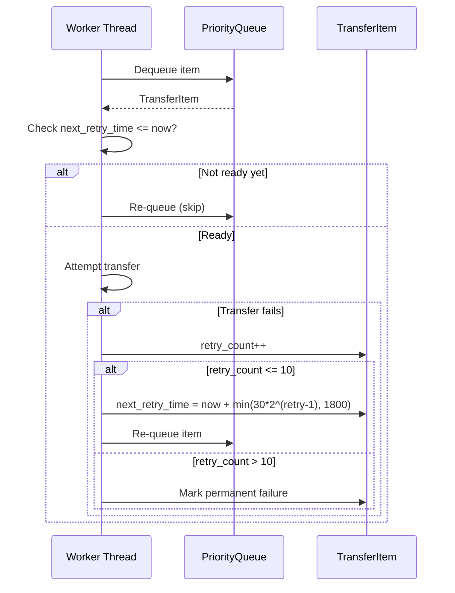

# Proximity Share — Key Workflows

## Application Startup

1. `main.py` calls `ProximityShareApp().run()`
2. `build()` initializes Config, NetworkDiscovery, TransferManager, SystemTrayManager
3. `Clock.schedule_once(_start_services, 0.1)`
4. `_start_services`: `NetworkDiscovery.start()`, `TransferManager.start()`
5. NetworkDiscovery registers mDNS service, starts ServiceBrowser
6. TransferManager starts worker thread

## File Send Workflow

1. `queue_file(file_path, target_device)` → creates TransferItem with size-based priority
2. Worker thread dequeues item
3. `FileContainer.create_from_file()` packages the file
4. `TransferProtocol.send_file()` connects to peer TCP
5. Sends `FILE_OFFER`, waits for `FILE_ACCEPT`
6. Sends `FILE_DATA` (serialized container), waits for `FILE_ACK`
7. On failure: `retry_count++`, calculate exponential backoff delay, re-queue

## File Receive Workflow

1. Protocol server accepts TCP connection
2. Reads 8-byte header (`msg_type` + `msg_size`)
3. On `FILE_OFFER`: auto-sends `FILE_ACCEPT`
4. On `FILE_DATA`: deserializes `FileContainer.from_bytes()`
5. Verifies SHA-256 checksum
6. Saves to shared folder (handles duplicates)
7. Sends `FILE_ACK`

## Device Discovery

1. Zeroconf registers `_proximityshare._tcp.local.` service
2. ServiceBrowser listens for peers
3. `P2PServiceListener.add_service` → stores in `discovered_devices`
4. `P2PServiceListener.remove_service` → removes from `discovered_devices`

## Retry Logic

- Exponential backoff: `delay = min(30 * 2^(retry_count-1), 1800)`
- Items re-queued with `next_retry_time` set
- Worker skips items whose `next_retry_time > current time`
- Max 10 retries before permanent failure

